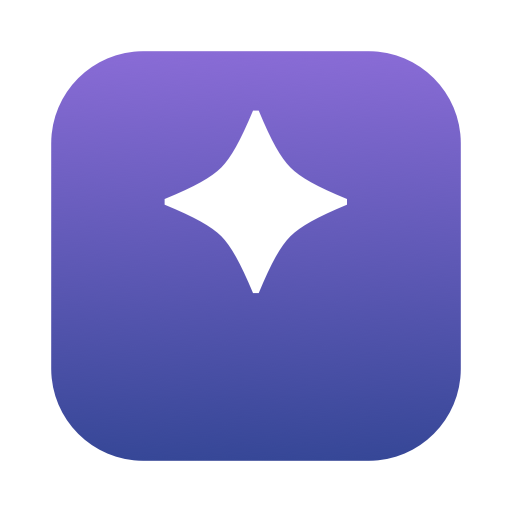
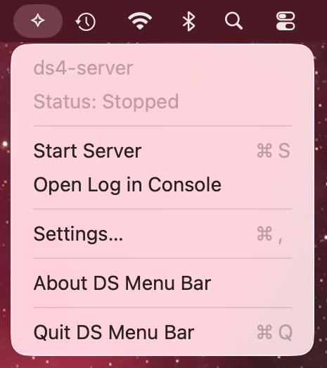
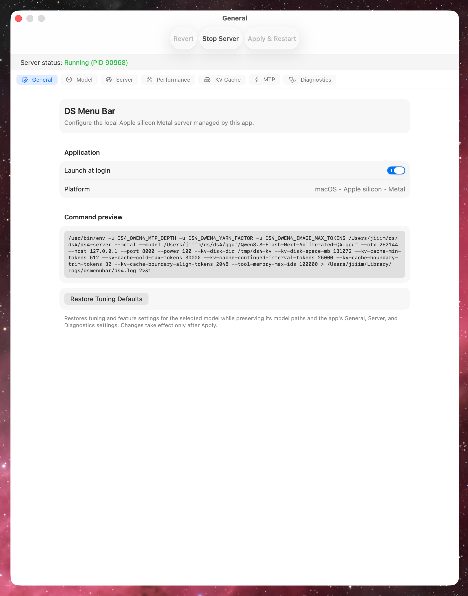

<p align="center">
  
</p>

<h1 align="center">DS Menu Bar</h1>

DS Menu Bar is a native macOS menu bar app for starting, stopping, and
configuring one local [`ds4-server`](https://github.com/antirez/ds4) process.
It keeps DwarfStar server status and common controls available without keeping
a terminal window open.

DS Menu Bar manages one Metal server on the Mac where the app is running. It
does not manage remote, distributed, Linux, CUDA, or ROCm servers.

<p align="center">
  
</p>

## What it does

- Starts, stops, and monitors `ds4-server`.
- Shows the server state and process ID in the menu bar.
- Provides model-aware settings for the server, model, performance, KV cache,
  MTP, and diagnostics.
- Detects supported DwarfStar GGUF model families and validates related files
  before starting the server.
- Captures server output in a rotating log that can be opened in Console.
- Can optionally record a request trace for diagnostics.
- Can launch automatically when you log in.

## Requirements

- macOS 26 or later
- An Apple silicon Mac
- A separately built `ds4-server` executable
- A compatible DwarfStar-specific main GGUF model

Follow the [DwarfStar project](https://github.com/antirez/ds4) for server build
instructions and model information. DS Menu Bar does not include `ds4-server`
or model files.

## Supported models

DS Menu Bar recognizes DwarfStar GGUFs for DeepSeek V4 Flash and single-file
DeepSeek V4 Pro, DeepSeek V4.1 Flash, Qwen3.8 Flash Next, GLM 5.2 (full),
GLM 5.3 (full), and GLM 5.3 Flash, along with their applicable DwarfStar
support files.

Distributed and split-model configurations, including the split DeepSeek V4
Pro pipeline, are not supported. DwarfStar-specific GGUFs are required;
arbitrary GGUF models are not supported.

## Install

1. Download the DMG and its `.sha256` file from the
   [latest release](https://github.com/jiiim/ds-menu-bar/releases/latest).
2. In Terminal, verify the download from the directory containing both files:

   ```sh
   shasum -a 256 -c DS-Menu-Bar-vX.Y.Z-arm64.dmg.sha256
   ```

3. Open the DMG and drag **DS Menu Bar** onto the **Applications** shortcut.
4. Open **DS Menu Bar** from `/Applications`.

Release DMGs are signed with Developer ID and notarized by Apple for normal
Gatekeeper validation.

## First run

The setup window asks for two files:

1. Your `ds4-server` executable.
2. The main GGUF model that the server should load.

After setup, use the star icon in the menu bar to start or stop the server,
open its log, or open Settings. Applying settings while the server is running
restarts it with the updated configuration.

The General tab in Settings shows the generated command before it is run.
Available controls and defaults adapt to the selected model and the Mac's
unified memory.

<p align="center">
  
</p>

## Logs and request traces

Server output is written to `~/Library/Logs/dsmenubar/ds4.log` by default. The
log includes the launch command and server output and may therefore contain
local paths and diagnostic details. DS Menu Bar creates it with owner-only
permissions and keeps one rotated backup.

Request tracing is optional. A request trace can contain prompts, generated
output, cache decisions, and tool calls. Treat trace files as private data and
enable tracing only when needed. The Diagnostics tab keeps the selected trace
path when tracing is off and can delete an inactive trace.

## Build from source

Building requires macOS 26, an Apple silicon Mac, and the Xcode Command Line
Tools.

```sh
xcode-select --install
make test
make bundle
```

The app bundle is written to `.build/debug/DS Menu Bar.app`. To build a release
bundle and install it in `/Applications`:

```sh
make install
```

Source builds use an ad hoc signature and are intended for local development.

## Uninstall

Disable **Launch at login** in Settings, quit DS Menu Bar, and move
`/Applications/DS Menu Bar.app` to the Trash.

## License

DS Menu Bar source code and original bundled assets are available under the
[MIT License](LICENSE). Copyright 2026 James Martin.

`ds4-server`, GGUF models, macOS, and Xcode are separate works and are not
licensed by this project. Refer to their respective terms and licenses.
